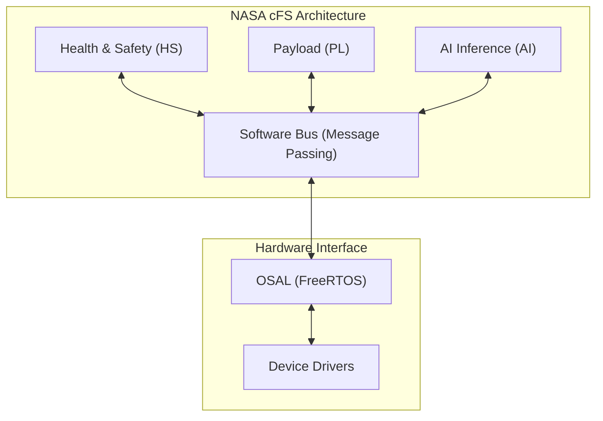

# 🛰️ Feza-X: Küp Uydu Sistem Mimarisi Sunumu
## *TUA Astro Hackathon 2026 - Geleceğin Uzay Mimarisi*

---

## 📽️ Sunum Akışı (Agenda)
1.  **Vizyon ve Misyon:** "Uzayda Veri, Dünyada Zaman"
2.  **Sistem Spesifikasyonları:** Teknik Derin Bakış
3.  **Donanım Mimarisi:** 3U Modüler Katmanlar
4.  **Yazılım İnovasyonu:** NASA-cFS ve Software Bus
5.  **Kenar Yapay Zeka (Edge AI):** Uzayda Veri İşleme Pipeline'ı
6.  **Stratejik Avantajlar:** Mekanik Kararlılık ve Enerji Bütçesi
7.  **Siber Güvenlik:** STRIDE Modeli ve Şifreleme
8.  **Görev Operasyonları (CONOPS):** Yaşam Döngüsü Fazları
9.  **Milli Uzay Vizyonu:** Stratejik Uyum ve Yerlilik
10. **Sonuç:** Takım ve Gelecek Projeksiyonu

---

## 1. Vizyon ve Misyon
> "Feza-X, kısıtlı bant genişliğini değil, kısıtlı zamanı yönetir."

*   **Problem:** LEO yörüngesindeki 3U uyduların sensör çözünürlükleri artarken, yer istasyonuna veri indirme (Downlink) kapasitesi darboğaz oluşturmaktadır.
*   **Çözüm:** Veriyi indirmeden önce "uzayda eleyen" ve "sadece değerli olanı ileten" akıllı mimari.
*   **Hedef:** Türkiye'nin orta çözünürlüklü görüntüleme ihtiyacına düşük maliyetli ve güvenilir bir platform sunmak.

*💡 **Konuşmacı Notu:** Burada uydunun sadece görüntü çeken bir kamera değil, yörüngede çalışan bir veri merkezi olduğunu vurgulayın.*

---

## 2. Teknik Spesifikasyonlar (Deep-Dive)

| Parametre | Hedef Değer | Açıklama |
| :--- | :--- | :--- |
| **GSD (Ground Resolution)** | 5.0m @ 500km | Multispektral (R, G, B, NIR) |
| **Kütle / Form Faktörü** | 3.9 kg / 3U | 10x10x34 cm standart yapı |
| **Güç Üretimi (Avg)** | 14.5 W | Body-mounted GaAs güneş panelleri |
| **Veri Yolu (High-Speed)** | 200 Mbps | SpaceWire (Payload -> Edge AI) |
| **Yörünge Ömrü** | 8 - 12 Yıl | Doğal de-orbit dahil |

*💡 **Konuşmacı Notu:** 5 metre GSD'nin 3U bir platform için oldukça iddialı bir hedef olduğunu ve Edge AI sayesinde bu verinin yönetilebilir kılındığını belirtin.*

---

## 3. Donanım Mimarisi: 3U Katmanlı Tasarım
Feza-X, fiziksel ve elektriksel olarak 3 bağımsız birime ayrılmıştır:

*   **Unit 1 (Alt): Altyapı Bloğu**
    *   EPS (Güç Dağıtım), Batarya Modülleri (40Wh), ADCS (3-Axis Reaction Wheels).
    *   *Strateji:* En ağır bileşenleri alta koyarak "Gravity Gradient" stabilizesini pasif olarak destekler.
*   **Unit 2 (Orta): Haberleşme & Kontrol Bloğu**
    *   OBC (Cortex-M7), UHF/VHF Transceiver, S-Band Anten Dizisi.
*   **Unit 3 (Üst): Görev Yükü Bloğu**
    *   Optik Sensör, CMOS Kamera, Edge AI İşlemcisi (NPU).

---

## 4. Yazılım İnovasyonu: NASA-cFS ve Software Bus
Uydunun yazılımı, NASA'nın Core Flight System (cFS) mimarisi üzerine inşa edilmiştir.

*   **Modülerlik:** Her uygulama (App) birbirinden bağımsızdır, biri hata verirse sistemin geri kalanı çalışmaya devam eder.
*   **Software Bus:** Publish/Subscribe modeliyle verimli dahili haberleşme.

---

## 5. Kenar Yapay Zeka (Edge AI) Pipeline
Veri indirme darboğazını aşan 3 adımlı süreç:

1.  **Görüntüleme:** SpaceWire üzerinden 480Mbps ham veri akışı.
2.  **Inference (Uzayda İşleme):** 
    *   **Bulut Eleme:** %70'den fazla bulut içeren karelerin otomatik silinmesi.
    *   **ROI Tespiti:** Gemi, konvoy veya arazi değişimi gibi bölgelerin tespiti.
3.  **Özetleme:** Sadece "anlamlı" piksellerin ve bulguların S-Band üzerinden iletimi.

*💡 **Konuşmacı Notu:** Bu teknoloji sayesinde yer istasyonuna indirilen çöp veri miktarı %90 oranında azalmaktadır.*

---

## 6. Stratejik Avantaj: Body-Mounted Kararlılığı
ISISpace gibi açılır paneller yerine gövde entegre panellerin tercih edilme nedenleri:

*   **Aerodinamik Kararlılık:** Açılır panellerin oluşturduğu tork etkisi yok, ADCS iş yükü %30 daha az.
*   **Titreşimsiz Çekim:** Esnek açılır kolların (Deployables) neden olduğu mikroskobik titreşimler elenir, daha net görüntüler elde edilir.
*   **Güvenilirlik:** Uzaydaki mekanik arıza risklerinin (panellerin açılmaması vb.) %100 eliminasyonu.

---

## 7. Siber Güvenlik: Uzayda Güvenli Veri
Feza-X, STRIDE tehdit modeliyle korunmaktadır:

*   **Uplink (Komuta):** HMAC-SHA256 ile imzalanmış komut paketleri (Anti-spoofing).
*   **Downlink (Veri):** AES-256-GCM ile bilimsel verilerin şifrelenmesi.
*   **Sistem:** Read-only bootloader ve ECC (Error Correction Code) bellek yönetimi.

*💡 **Konuşmacı Notu:** "Cybersecurity is mission critical, not an option" sözüyle siber güvenliğin önemini vurgulayın.*

---

## 8. Görev Operasyonları (CONOPS)
*Görevin 5 Kritik Fazı:*

1.  **Faz-A (LEOP):** Fırlatma sonrası 30 dakikalık sessiz periyot ve sistem sağlığı beacon'ları.
2.  **Faz-B (Commissioning):** Alt sistemlerin (ADCS kalibrasyonu, Kamera odaklama) teyidi.
3.  **Faz-C (Nominal Ops):** Hedef bölge üzerinden geçerken otonom çekim ve Edge AI işleme.
4.  **Faz-D (Extended):** Yörüngede yazılım ve AI modeli güncellemeleri.
5.  **Faz-E (De-orbit):** Pasivasyon ve kontrollü irtifa kaybı.

---

## 9. Milli Uzay Vizyonu ve Yerlilik
Feza-X, Türkiye'nin **10 Yıllık Milli Uzay Programı** ile tam uyumludur:

*   **Uydu Teknolojileri:** Gözlem uyduları alt yapısı için yerli mimari referansı.
*   **Yerli Partnerler:** ASELSAN (Haberleşme), TÜBİTAK UZAY (Yazılım), ASPİLSAN (Enerji) standartlarına uygun ICD topolojisi.
*   **Vizyon:** Teknolojik bağımsızlık ve "Açık Kaynaklı Uzay Mimarisi" liderliği.

---

## 🚀 Sonuç: Feza-X Takımı
> "Yörüngeyi takip etmiyoruz, biz yörüngeyi tasarlıyoruz."

*   **Ekip:** Yazılım Mimarisi, Elektronik Tasarım ve Yörünge Bilimi uzmanları.
*   **İletişim:** [GitHub Repo Linki] / [İletişim Maili]

---
