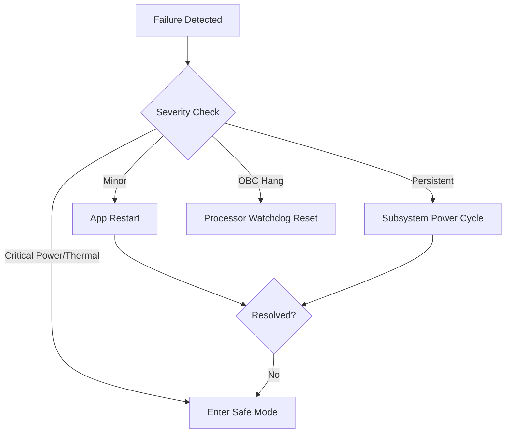

# 🛡️ FDIR: Fault Detection, Isolation, and Recovery Strategy

Feza-X employs a hierarchical FDIR strategy to ensure mission continuity under extreme space conditions. Failures are categorized by severity levels (L1-L4).

## 1. FDIR Levels & Actions

| Level | Severity | Detection | Recovery Action |
| :--- | :--- | :--- | :--- |
| **L1** | App Failure | Software Bus Timeout | Restart specific NASA-cFS Application. |
| **L2** | Minor Hardware | I2C/SPI Retry Failure | Subsystem Warm Reset (toggle EN pin). |
| **L3** | Processor Hang | Watchdog Trigger (WDT) | Processor Cold Reset (Full Boot). |
| **L4** | Power / Thermal | Battery Volts < 6.8V | **Safe Mode:** Only UHF Beacon & CI Active. |

## 2. Detection Mechanisms

### A. Health & Safety (HS) App
The `HS` app in NASA-cFS monitors "Heartbeat" messages from all registered apps. If an app fails to check in within 500ms, an L1 recovery is triggered.

### B. Memory Scrubbing
The OBC periodically scrubs ECC (Error Correction Code) RAM to detect and fix bit-flips caused by cosmic radiation (SEU). If the Error Rate > 1%, the system enters Safe Mode.

## 3. Safe Mode (Sun-Point Mode)
In **Safe Mode**:
1.  **Payload:** Powered OFF.
2.  **S-Band:** Powered OFF.
3.  **ADCS:** Enters "Sun-Point" mode using Magnetorquers to stay charged.
4.  **UHF:** Transmits a "Mayday" beacon every 30 seconds.

## 4. Recovery Tree Diagram

